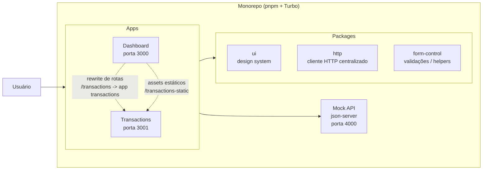

# DinDin

DinDin é um monorepo para uma aplicação de gestão financeira pessoal, composta por duas interfaces Web em Next.js e por pacotes compartilhados de UI, HTTP e validação de formulários.

## Visão geral

O projeto tem como objetivo reunir:

- um painel principal para visualização e navegação;
- um módulo dedicado a transações;
- componentes reutilizáveis e utilidades compartilhadas entre as aplicações.

## Arquitetura do monorepo

A estrutura principal é organizada da seguinte forma:



- apps/dashboard
  - aplicação principal do produto;
  - usa os pacotes compartilhados e redireciona rotas para o módulo de transações.
- apps/transactions
  - aplicação dedicada à gestão de transações;
  - expõe a experiência específica do fluxo de cadastro/consulta/edição.
- packages/ui
  - biblioteca de componentes visuais reutilizáveis.
- packages/http
  - cliente HTTP compartilhado para chamadas de API.
- packages/form-control
  - utilidades e helpers para formulários e controles.
- config/db
  - base local para mock de API com json-server.

## Ferramentas e tecnologias

- Next.js 16
- React 19
- TypeScript
- Tailwind CSS
- pnpm + Turbo
- Storybook
- json-server

## Como as aplicações se comunicam

A comunicação entre as partes do projeto acontece de três formas principais:

1. Dependências workspace
   - As aplicações consomem pacotes internos via workspace do pnpm.
   - Isso evita duplicação de código e mantém a UI e as regras de HTTP centralizadas.

2. Rewrites entre as aplicações
   - A aplicação dashboard usa a configuração de rewrites no arquivo apps/dashboard/next.config.ts.
   - Isso permite que rotas como /transactions sejam encaminhadas para a aplicação transactions.

3. API local simulada
   - As chamadas de HTTP apontam para uma base local executada com json-server.
   - A URL da API é definida por variável de ambiente para facilitar o desenvolvimento local.

## Como rodar o projeto

### 1. Instalar dependências

```bash
pnpm install
```

### 2. Configurar variáveis de ambiente

Crie um arquivo .env para cada aplicação com base no exemplo disponível em env.example.

### 3. Iniciar a API mock

```bash
pnpm server
```

A API ficará disponível em:

- http://localhost:4000

### 4. Rodar as aplicações

É possível rodar as aplicações das seguintes formas:

Em um único terminal:

```bash
pnpm dev
```

Em terminais separados:

```bash
pnpm dev:dashboard
```

```bash
pnpm dev:transactions
```

Os serviços ficam em:

- dashboard: http://localhost:3000
- transactions: http://localhost:3001

### 5. Rodar a biblioteca de componentes

```bash
pnpm storybook:ui
```

O Storybook ficará disponível em:

- http://localhost:6006

## Scripts úteis

No root do monorepo, você pode usar:

```bash
pnpm dev
pnpm build
pnpm lint
pnpm clean
```
